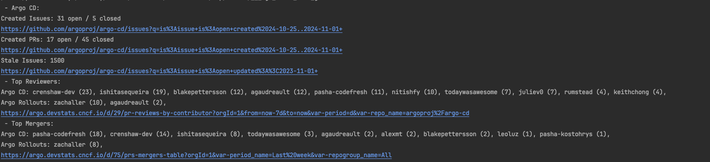

## Features

- **Issues and Pull Requests**
    - Summarizes open and closed issues and PRs to give an overview of engagement and project progress.
    - Highlights stale issues to prioritize backlog items that need review.

- **Top Reviewers and Mergers**
    - Identifies and lists top reviewers and mergers based on activity, supporting recognition and balanced contributions.

- **Project-Specific Data**
    - Tracks stats for both ArgoCD and Argo Rollouts, with options to include other repos.
    - Provides detailed insights to support project-specific contributions.

## Output

The tool generates a pre-formatted Google document that includes:

- Created Issues: Open / Closed
- Created PRs: Open / Closed
- Stale Issues
- Top Reviewers and Mergers (by project)



## Usage

1. **Build the application:**

   ```bash
   go build -o argo-cd-contrib-insights
    ```
2. **Run the application:**

   ```bash
   ./argo-cd-contrib-insights 
    ```